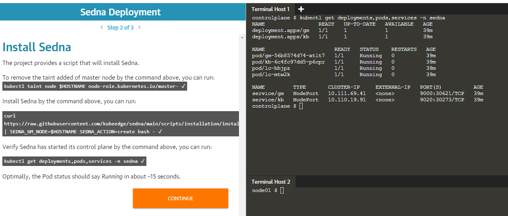

# Sedna Katacoda-Scenarios

We have created a tutorial in the interactive learning platform Katacoda for Sedna deployment.
This can give a hands-on experience of Sedna deployment. The tutorial is created on Sedna release v0.3.1.

 

This is available on <https://katacoda.com/sedna/scenarios/deployment>

Please try it out !!!
